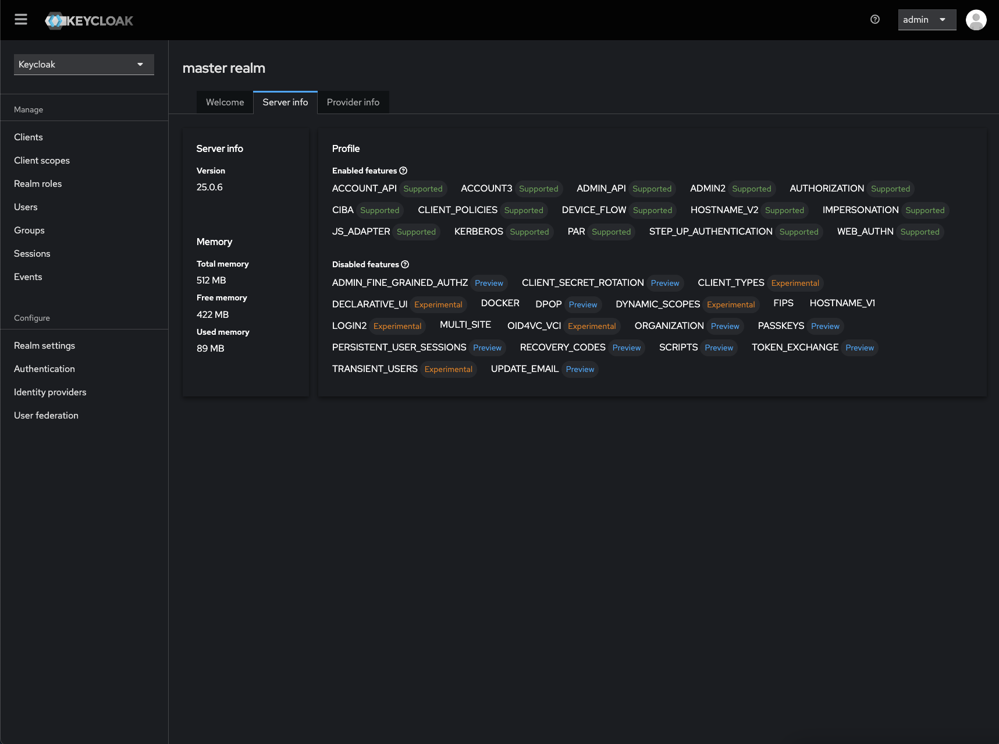

# Install Keycloak from DSO Ironbank
- Requirements:
  - Software:
    - kubectl
    - helm
    - git
  - A Kubernetes cluster of your choice
  - **Registration to IronBank (requires creating a login)**
    - Includes repo1.dso.mil, registry1.dso.mil, and ironbank.dso.mil
      - Note: You need a valid company email address and authenticator App through Google

## Git Clone Repo1 Keycloak Repository
- We will work in the `/var/tmp/` directory for this example

```sh
cd /var/tmp
git clone https://repo1.dso.mil/big-bang/product/packages/keycloak.git
cd keycloak/chart
helm package . 
```
- You should get a successfully packaged chart from there. Save it elsewhere where you want to deploy your code. In this instance, it will be save outside of the git folder that was created when cloned.

```sh
mv keycloak-<version>.tgz ../../
```

## Install Cert-Manager
- Install Cert-Manager for certificate management and leverage self-signed CA or bring your own!

```sh
helm repo add jetstack https://charts.jetstack.io --force-update
helm upgrade -i \
  cert-manager jetstack/cert-manager \
  --namespace cert-manager \
  --create-namespace \
  --version v1.16.1 \
  --set crds.enabled=true
```

## Create Cluster Issuer and CA Certificate to Issue Self-Signed Certs
```sh
kubectl apply -f -<<EOF
apiVersion: cert-manager.io/v1
kind: ClusterIssuer
metadata:
  name: selfsigned-issuer
spec:
  selfSigned: {}
---
apiVersion: cert-manager.io/v1
kind: Certificate
metadata:
  name: kc-lab-ca
  namespace: cert-manager
spec:
  isCA: true
  commonName: kc-lab
  secretName: root-secret
  privateKey:
    algorithm: ECDSA
    size: 256
  issuerRef:
    name: selfsigned-issuer
    kind: ClusterIssuer
    group: cert-manager.io
---
apiVersion: cert-manager.io/v1
kind: ClusterIssuer
metadata:
  name: kc-lab-clusterissuer
spec:
  ca:
    secretName: root-secret
EOF
```

## Create Registry1 Secret
- Create secret with your access to Registry1 DSO
  - fill in the blanks for username and password

```sh
kubectl create namespace keycloak
kubectl -n keycloak create secret docker-registry registry1-secret \
  --docker-server='registry1.dso.mil' \
  --docker-username='<your-name>' \
  --docker-password='<your-password>' \
  --docker-email='<your email>'
```

## Keycloak Values
```sh
cat > keycloak-values.yaml <<EOF
# Additional Pod annotations
podAnnotations: {}

# Pod Labels for Keycloak
podLabels: {}

#
command:
  - "/opt/keycloak/bin/kc.sh"
#
args:
  - "start"

#
proxy:
  enabled: true
  mode: xforwarded

# THESE VALUES ARE FOR TLS TERMINATION AT THE PROXY (NGINX), NOT THE POD ITSELF
## NOTE: STRICT HOSTNAME SHOULD BE ENFORCED TO PREVENT SPOOFING
extraEnv: |-
  - name: KC_HOSTNAME
    value: keycloak.example.com
  - name: KC_CACHE_STACK
    value: "kubernetes"
  - name: KC_HOSTNAME_STRICT
    value: "true"
  - name: KC_HOSTNAME_DEBUG
    value: "true"
  - name: KC_HTTP_ENABLED
    value: "true"
  - name: KEYCLOAK_ADMIN
    value: "admin"
  - name: KEYCLOAK_ADMIN_PASSWORD
    value: "password"
  - name: KEYCLOAK_PRODUCTION
    value: "true"
  - name: KC_HEALTH_ENABLED
    value: "true"
  - name: JAVA_OPTS_APPEND
    value: "-Djgroups.dns.query=keycloak-headless"
  - name: KC_LOG_LEVEL
    value: "org.keycloak.events:DEBUG,org.infinispan:INFO,org.jgroups:INFO"
  - name: QUARKUS_TRANSACTION_MANAGER_ENABLE_RECOVERY
    value: "true"

#
replicas: 1

#
image:
  repository: registry1.dso.mil/ironbank/opensource/keycloak/keycloak
  tag: "25.0.6"
  pullPolicy: IfNotPresent
#
imagePullSecrets:
- name: registry1-secret
#
updateStrategy: RollingUpdate

# SecurityContext for the Keycloak container
podSecurityContext:
  fsGroup: 2000
  runAsUser: 2000
  runAsGroup: 2000
  runAsNonRoot: true

securityContext:
  runAsUser: 2000
  runAsGroup: 2000
  runAsNonRoot: true
  capabilities:
    drop:
      - ALL
#
resources:
  requests:
    cpu: "500m"
    memory: "1Gi"
  limits:
    cpu: "1"
    memory: "1Gi"
#
## Network policy configuration
networkPolicy:
  # If true, the Network policies are deployed
  enabled: false

dbchecker:
  enabled: true
  image:
    # Docker image used to check Postgresql readiness at startup
    repository: registry1.dso.mil/ironbank/opensource/postgres/postgresql12
    # Image tag for the pgchecker image
    tag: "12.20"
    # Image pull policy for the dbchecker image
    pullPolicy: IfNotPresent
  # SecurityContext for the dbchecker container
  securityContext:
    allowPrivilegeEscalation: false
    runAsUser: 1000
    runAsGroup: 1000
    runAsNonRoot: true
    capabilities:
      drop:
        - ALL
  # Resource requests and limits for the dbchecker container
  resources:
    requests:
      cpu: "250m"
      memory: "256Mi"
    limits:
      cpu: "250m"
      memory: "256Mi"

#
autoscaling:
  # If `true`, an autoscaling/v2beta2 HorizontalPodAutoscaler resource is created (requires Kubernetes 1.18 or above)
  # Autoscaling seems to be most reliable when using KUBE_PING service discovery (see README for details)
  # This disables the `replicas` field in the StatefulSet
  enabled: false
  # Additional HorizontalPodAutoscaler labels
  labels: {}
  # The minimum and maximum number of replicas for the Keycloak StatefulSet
  minReplicas: 3
  maxReplicas: 10
  # The metrics to use for scaling
  metrics:
    - type: Resource
      resource:
        name: cpu
        target:
          type: Utilization
          averageUtilization: 80
  # The scaling policy to use. This will scale up quickly but only scale down a single Pod per 5 minutes.
  # This is important because caches are usually only replicated to 2 Pods and if one of those Pods is terminated this will give the cluster time to recover.
  behavior:
    scaleDown:
      stabilizationWindowSeconds: 300
      policies:
        - type: Pods
          value: 1
          periodSeconds: 300
#
postgresql:
  # If `true`, the Postgresql dependency is enabled
  enabled: true
  # PostgreSQL User to create
  postgresqlUsername: keycloak
  # PostgreSQL Password for the new user
  postgresqlPassword: keycloak
  # PostgreSQL Database to create
  postgresqlDatabase: keycloak
  # PostgreSQL network policy configuration
  networkPolicy:
    enabled: false
  # Added by BigBang
  # change bitnami sub-chart upstream image to pull from registry1.dso.mil
  # this image is only used for dev and CI pipelines
  global:
    imagePullSecrets:
      - registry1-secret
  image:
    registry: registry1.dso.mil
    repository: ironbank/opensource/postgres/postgresql12
    tag: 12.15
  securityContext:
    enabled: true
    fsGroup: 26
    runAsUser: 1001
    runAsGroup: 1001
  containerSecurityContext:
    enabled: true
    runAsUser: 26
    capabilities:
      drop:
        - ALL
#
secrets: {}

domain: example.com
istio:
  # Toggle istio integration
  enabled: false

#
ingress:
  # If `true`, an Ingress is created
  enabled: true
  # The name of the Ingress Class associated with this ingress
  ingressClassName: "nginx"
  # The Service port targeted by the Ingress
  servicePort: http
  # Ingress annotations
  annotations:
    cert-manager.io/cluster-issuer: kc-lab-clusterissuer
    nginx.ingress.kubernetes.io/use-forwarded-headers: 'true'
    nginx.ingress.kubernetes.io/proxy-buffer-size: 128k
    nginx.ingress.kubernetes.io/ssl-redirect: 'true'

  # Additional Ingress labels
  labels: {}
   # List of rules for the Ingress
  rules:
    -
      # Ingress host
      host: '{{ .Release.Name }}.example.com'
      # Paths for the host
      paths:
        - path: '{{ tpl .Values.http.relativePath $ | trimSuffix "/" }}/'
          pathType: Prefix
# Example TLS configuration
  tls:
    - hosts:
        - keycloak.example.com
      secretName: "kc-tls-cert"

  # ingress for console only (/auth/admin)
  console:
    enabled: true
    ingressClassName: "nginx"
    annotations:
      cert-manager.io/cluster-issuer: kc-lab-clusterissuer
      nginx.ingress.kubernetes.io/use-forwarded-headers: 'true'
      nginx.ingress.kubernetes.io/proxy-buffer-size: 128k
      nginx.ingress.kubernetes.io/ssl-redirect: 'true'


    rules:
      -
        # Ingress host
        host: '{{ .Release.Name }}-console.example.com'
        # Paths for the host
        paths:
          - path: '{{ tpl .Values.http.relativePath $ | trimSuffix "/" }}/admin'
            pathType: Prefix

    # Console TLS configuration
    tls:
     - hosts:
         - '{{ .Release.Name }}-console.example.com'
       secretName: "kc-console-tls-cert"
EOF
```

## Install Keycloak
```sh
helm upgrade -i keycloak ./keycloak-2.5.1-bb.3.tgz --namespace keycloak -f keycloak-values.yaml
```

## Login To Keycloak
**Navigate to keycloak.example.com/auth and use the login you created within the KC-ENV Vars**
- user: admin
- password: password (Please Change this!)

